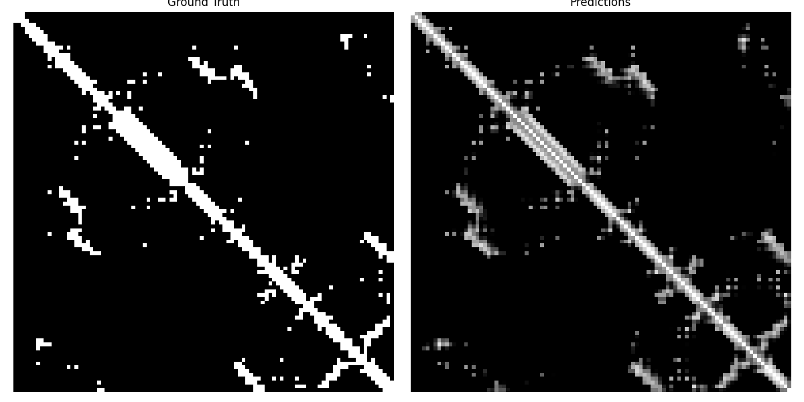
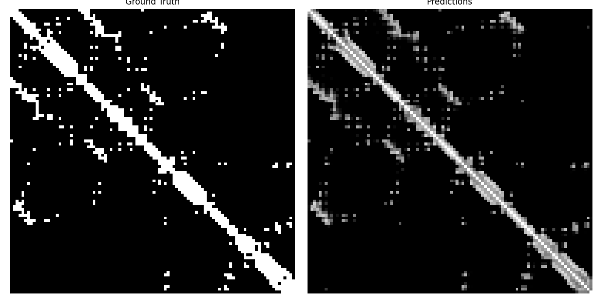

# Protein residues contact map prediction usign ESM2 embeddings

This Project is using convolutional model to predict contact map of protein residues using ESM2 embeddings and similar proteins structural information (inter residue distances and orientations).

## Example Results

## Model architecture

Model gets 2 tensors as an input

1. pairwise embeddings created using ESM2 model. In our case I am using `esm2_t6_8M_UR50D` model, because it is the smalles one. it takes as an input protein sequence in string format and gives a tensor as an output with shape (L + 2, D) where L is the length of the sequence and D is the size of the embeddings, we are removing first and last embeddings, because they are embeddings of start token and end token. After that we are creating a pairwise embeddings tensor with shape (L, L, 2 * D), where in the (i, j) coordinates we have embeddings of i-th and j-th residues

2. as second input model gets tensor which contains structural information of similar protein sequences. for each similar sequence we are creating a tensor with shape (L, L, 3) where as a first channel it contains distance information between residues, second channel is theta (polar angle) and third channel is phi (azimuthal orientation). Then we are concatenating That type of information for k number of similar protein sequences and at the end we have tensor of shape (L, L, 3 * k)

Then we are passing each input by their convolutional backbones, pairwise embeddings we are downsampling to have at the end tensor of shape (L, L, 128) and structural tensor we are upsampling to have tensor of shape (L, L, 64)

After we are concatenating them and passing through the fusion part of the model which is again a convolutional model. At the end we have matrix of shape (L, L)

## Training

### Preprocessing

1. Creating a `BLAST` database from train dataset which I will use later to find similar protein sequences.
2. Computing distances between residues Cα atoms and computing contact map (Two residues are considered in contact if the distance between their Cα atoms is below 8 Å (angstroms)). This will be our ground truth
3. Computing `ESM2` embeddings and creating pairwise embeddings from input protein sequence.
4. Using BLAST database to find top `k` similar sequences (remove current input sequence if it is in the database).
5. Align those sequences with query sequence and for each similar sequence get the distance and orientation information
6. Normalize inputs

### Training Information

Because contact matrix is symmetric and its diagonal is always ones, I decided to add a head to the model which will help him to predict only upper triangle matrix without diagonal, and then we can create our tensor from that upper triangle matrix. It makes problem easier and helped model to train faster and better.

As a loss I used weighted sum of `Dice` and `binary cross entropy` losses. Also I gave a weight to the positive class of `binary cross entropy` loss because of class imbalance in our data (Contact maps are very sparse).

`AdamW` is used as an optimizer and as a scheduler I used `OneCycleLR` with cosine annealing strategy.

`F1 score` and `Accuracy` are used as metrics

You can find training example in `train.ipynb` notebook

## Limitations

In the code I did some simplifactions and added limitations to be able to experiment with limited compute access (I was working only with one Nvidia 3050Ti and sometime in google colab notebook)

1. I have added variable max_sequence_lenght which gets only first 100 residues from the sequence
2. I am working only with first chain of the protein from PDB files
3. I am using smallest ESM2 architecture
4. I trained only on a small subset of the dataset to be sure that model is learning

## TODOs

There are a lot of improvements that can be done on the project :)

1. Add batched inference (currently we are unable to do batched inference due to variabel length of the input sequences)
2. Experiment with different model architectures
3. Train on longer sequences and on a bigger dataset
4. Make dataset module faster, because there are currently a lot of work is done in runtime and it can be preprocessed differently to make training faster
5. Experiment with learning rate and scheduler to find best choise
6. Fix warning from the BLAST